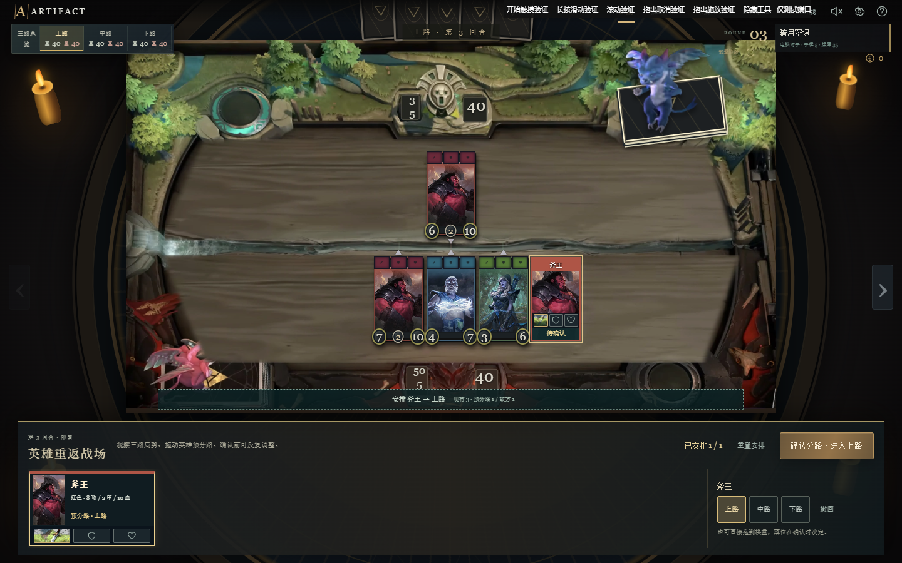

# Artifact Threefold

Artifact Threefold is an unofficial browser recreation of Valve's Artifact Classic. It includes complete single-player matches, an 18-stage campaign, deck building, and persistent two-player rooms that use short match codes.

[Play the live demo](http://101.43.178.127/)



> Project status: the main game loop is playable from start to finish, but some edge-case rules and presentation details still differ from the original client. See [IMPLEMENTATION.md](IMPLEMENTATION.md) for the current implementation notes.

## Features

- 303 Classic cards and derived units, plus a custom Dota 2 expansion: 2 heroes, 4 spells, and 1 token (50 heroes total)
- Three independent lanes, towers, ancients, initiative, deployment, combat, and shopping
- Five starter decks, custom deck building, deck validation, and JSON import/export
- Local single-player matches with a computer opponent and browser-based saves
- An 18-stage **Dark Moon Shards** campaign with separate progression
- Match-code multiplayer with reconnectable, server-persisted rooms
- Responsive mouse and touch controls, original music, sound effects, and card audio previews

## Quick Start

The recommended setup starts the Node.js server because it supports every game mode.

### Requirements

- [Node.js](https://nodejs.org/) 22.13 or newer
- npm 10 or newer (included with current Node.js releases)
- A current desktop browser such as Chrome, Edge, or Firefox

### Run all game modes

```bash
git clone https://github.com/NigelYao/Artifact_Web.git
cd Artifact_Web
npm ci
npm start
```

Open these pages after the server starts:

| Mode | URL |
| --- | --- |
| Main menu and single player | <http://127.0.0.1:8787/> |
| Dark Moon Shards campaign | <http://127.0.0.1:8787/campaign.html> |
| Match-code multiplayer | <http://127.0.0.1:8787/online.html> |
| Health check | <http://127.0.0.1:8787/health> |

On Windows, `start-online.cmd` provides the same startup flow and installs dependencies when they are missing. Stop the server with `Ctrl+C`.

### Run single player without Node.js

Single player and the campaign are static and do not need npm packages. With Python 3 installed, run:

```bash
python start.py
```

The script serves `dist/` at <http://127.0.0.1:8787/> and opens the browser. You can also open `dist/index.html` directly, although a local web server avoids browser restrictions on local files.

To use a different address or port:

```bash
python start.py --host 127.0.0.1 --port 8080 --no-browser
```

## Custom Dota 2 expansion

Choose **荆棘与剑舞** in the deck selector to play Pangolier (石鳞剑士) and Dark Willow (邪影芳灵). They use official Valve hero art, ability icons, and localized names, with custom Threefold mechanics. These are not Artifact Classic cards. Signature spells are included automatically; Rolling Thunder and Terrorize can be added through the deck builder.

See [the expansion rules and source credits](research/dota2-expansion.md) for damage, shield, root, Shadow Realm, delayed Jex, and face-down rules. Run `npm run test:expansion` for focused engine coverage.

## Multiplayer

One player creates a six-character match code and the other joins with that code. Both players select a local or built-in deck and confirm readiness before the match begins. No account is required.

The Node.js server listens on `0.0.0.0:8787` by default, so another device on the same network can connect through the host computer's LAN address. The firewall must allow TCP 8787. Public deployments also need a reverse proxy that supports WebSocket upgrades.

Room state is stored in `server/data/online.sqlite`. Keep that directory when upgrading or backing up a server. The directory also contains the generated administrator token and is intentionally excluded from Git.

See [ONLINE.md](ONLINE.md) for room recovery, deployment, administrator access, backups, and protocol details.

### Server configuration

| Variable | Default | Purpose |
| --- | --- | --- |
| `PORT` | `8787` | HTTP and WebSocket port |
| `HOST` | `0.0.0.0` | Listening address |
| `ARTIFACT_DB` | `server/data/online.sqlite` | Persistent SQLite database path |
| `ARTIFACT_ADMIN_TOKEN_FILE` | Next to the database | Administrator token file path |
| `ARTIFACT_ADMIN_TOKEN` | Generated on first start | Explicit 32-128 character URL-safe administrator token |

PowerShell example:

```powershell
$env:PORT = "8080"
$env:HOST = "127.0.0.1"
npm start
```

## Browser Data

Single-player saves, settings, and custom decks use the browser's `localStorage`. They are tied to the exact browser origin, so `localhost`, `127.0.0.1`, and a LAN IP each have separate data. Export a custom deck as JSON before changing browsers or addresses.

Multiplayer room state lives on the server, while the anonymous recovery identity remains in the browser. Clearing site data or changing the origin removes that identity.

## Testing

Install dependencies once with `npm ci`, then run the main grouped test set:

```bash
npm test
```

Focused suites are available while developing:

```bash
npm run test:online
npm run test:touch
npm run test:share
npm run test:matchmaking
npm run test:placement
```

Core engine and full-game checks can also be run directly:

```bash
node tests/engine.test.cjs
node tests/battle-regressions.cjs
node tests/feedback.test.cjs
node tests/audio.test.cjs
node tests/deployment.test.cjs
node tests/full-games.cjs
```

The frontend is plain HTML, CSS, and JavaScript under `dist/`; there is no bundling step for normal development. Refresh the browser after editing those files.

## Project Structure

| Path | Purpose |
| --- | --- |
| `dist/` | Browser application, game engine, card data, styles, and media |
| `server/` | Express, Colyseus, SQLite persistence, multiplayer rooms, and admin view |
| `tests/` | Engine, UI contract, touch, multiplayer, and regression tests |
| `research/` | Source snapshots, balance notes, audits, and asset credits |
| `tools/` | Data generation, scene generation, release, and deployment helpers |
| `scripts/` | Repeatable asset import and maintenance scripts |
| `CAMPAIGN.md` | Campaign design, rules, and validation notes |
| `ONLINE.md` | Multiplayer operation and deployment guide |
| `IMPLEMENTATION.md` | Implemented mechanics, known differences, and verification record |

Card data can be rebuilt from the included snapshots with Python 3 and no third-party Python packages:

```bash
python tools/build_data.py
```

Scene assets require Pillow, NumPy, and OpenCV:

```bash
python tools/build_scene.py
```

## Contributing

Pull requests are welcome. Good places to contribute include:

1. **Add new heroes and cards.** Extend the card data, decks, engine behavior, and focused tests together so new content is playable rather than display-only.
2. **Add skill effects.** Improve card-specific animation, audio, targeting feedback, and readable reduced-motion behavior.
3. **Fix bugs and complete features.** Rule edge cases, multiplayer recovery, touch controls, accessibility, performance, tests, and documentation all benefit from focused improvements.

For a smooth review:

1. Fork the repository and create a topic branch.
2. Keep each pull request focused on one behavior or content group.
3. Add or update a regression test when changing game rules or multiplayer state.
4. Run `npm test` and describe any additional browser checks in the pull request.
5. Preserve source and license information for any new third-party asset.

When reporting a bug, include the game mode, lane and round, the action that triggered it, and a saved deck or short reproduction sequence when possible.

## Credits and License

Artifact, Dota, character names, card art, music, sound effects, and related trademarks belong to Valve Corporation and their respective rights holders. This project is not affiliated with Valve and is not an official Artifact client. Source links and artwork attribution are recorded in `research/artwork-credits.json` and the research files.

The original project code is available under the [MIT License](LICENSE). That license does not grant rights to third-party game assets included for research and recreation purposes.

Useful upstream references include:

- [Valve Artifact Deck Code](https://github.com/ValveSoftware/ArtifactDeckCode)
- [Open Artifact set 0](https://github.com/Open-Artifact/artifactdb-set-0)
- [Open Artifact set 1](https://github.com/Open-Artifact/artifactdb-set-1)
- [ArtifactDB archive](https://github.com/0ttah/ArtifactDB)
- [GameTracking Artifact](https://github.com/SteamDatabase/GameTracking-Artifact)
